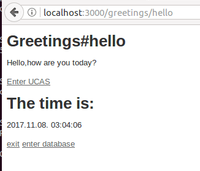
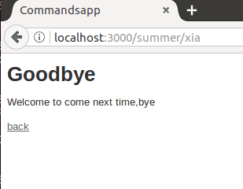
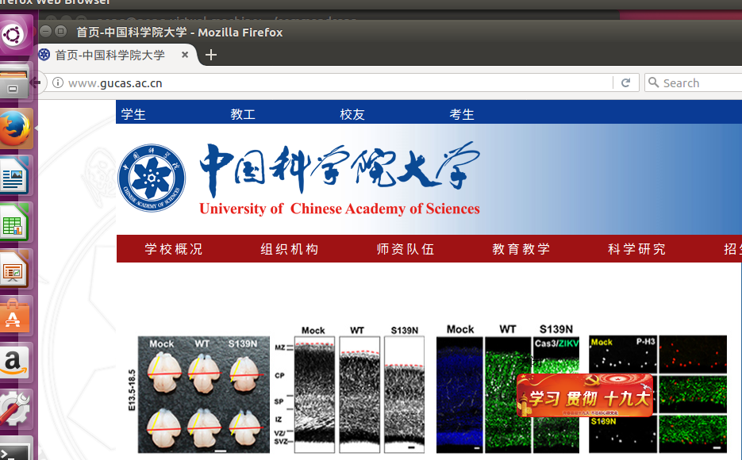
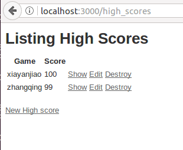
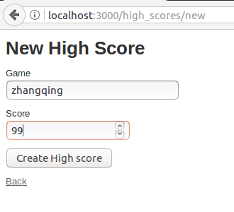
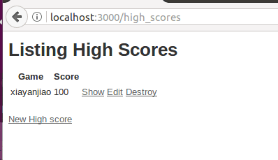

# HomeWork
软件工程作业 

HomeWork1 实现以下功能：（1）link到其他主页（2）显示本地时间（3）点击按钮，实现页面跳转 

# HomeWork1
进入Hello页面，显示服务器时间和国科大官网的链接 

 

点击exit后跳转到goodbye页面，如图所示： 

 

点击Enter UCAS后跳转到中国科学院大学的官网，如图所示： 

 

在Hello页面点击enter database跳转到数据库操作页面，该页面显示数据库记录并提供修改数据库功能，如图所示： 

 

点击New High score跳转到添加分数页面，如图所示： 

 

添加完数据后跳转到数据库显示页面，如图所示： 

 